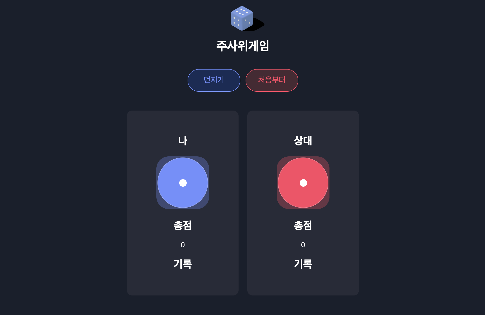

# 🎲 주사위게임

  

# 개발목표

react의 기본적인 문법을 이해하는데 의의를 두었습니다.

  

# 구현 기능

1. 던지기 버튼 클릭
- 던지기 버튼을 클릭 시 나와 상대의 랜덤 숫자를 state에 저장하여 표시
 

2. 처음부터 버튼 클릭
- 처음부터 버튼 클릭 시 던지기 버튼을 클릭했을 때 저장된 state 값 초기화
 

# 기술 스택

|  HTML   |  CSS   | Javascript |  React   |
| :-----: | :----: | :--------: | :------: |
| ![html] | ![css] |   ![js]    | ![react] |

<!-- Stack Icon Refernces -->

[js]: /src/etc/javascript.svg
[html]: /src/etc/html.svg
[react]: /src/etc/react.svg
[css]: /src/etc/css.svg
